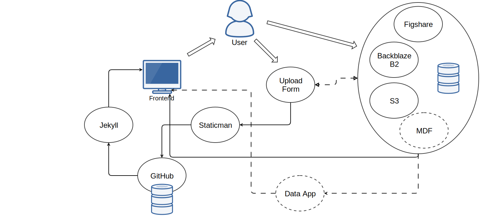

# Summary

Small scientific communities often require web infrastructure for
sharing and displaying data tailored to specific needs. The approach
used by the PFHub framework uses existing tools to provide a workflow
for uploading and viewing data requiring only a limited outlay on
custom development and configuration. The PFHub framework currently
supports phase field practitioners and code developers participating
in an effort to improve quality assurance for phase field codes. The
main thrust of this effort is the generation of a set of standardized
benchmark problems [@bm1, @bm2] along with a
web framework for uploading and comparing benchmark results.

# Context

The phase field method (PFM) describes material interfaces at the
mesoscopic scale between atomic scale models and macroscale
models. The PFM is well established and there are an assortment of
code frameworks (e.g. Moose [@moose], PRISMS-PF [@prisms-pf], FiPy
[@fipy], MMSP [@mmsp]) available for solving the wide variety of
phenomena associated with phase field (e.g. dendritic growth, spinodal
decomposition, grain growth). However, phase field research groups
often develop codes in isolation and do not publish the code bases or
do not support or distribute the code bases to the wider
community. PFHub is a community effort spearheaded by the Center for
Hierarchical Materials Design at Northwestern University and the
National Institute of Standards and Technology to support the
development of phase field codes. The goal of PFHub is to improve
cross-collaboration between phase field code developers and
practitioners by providing a site to compare results from different
codes on a standardized set of benchmark problems.

# Website

The PFHub website provides a facility for uploading, displaying and
comparing results from the benchmark problems. The website uses the
Jekyll static website generator along with automated frontend
processing to host all the content avoiding the use of a content
management system (see [blog
post](https://medium.com/devseed/how-we-build-cms-free-websites-d7e19d94a0ff)),
which are generally costly to maintain especially for small scientific
communities with limited funding and manpower [@csmfree].

The workflow for uploading benchmark results relies on third party tools
using the following steps.

 - The users are first required to archive simulation outputs at a
   recommended archival resource (e.g. Figshare).

 - The simulation result metadata is entered into a form on the
   website and includes entries for simple details such as memory
   usage, run time and links to the simulation outputs stored in an
   archival resource.

 - On submission the [Staticman app](https://staticman.net/) is used to send the
   entered metadata to a GitHub pull request in a meta.yaml file that
   is added in a unique directory in the PFHub GitHub repository.

 - Travis CI performs linting on the data and fires up a new version
   of the website using [Surge](https://surge.sh/) so that the PFHub
   admins and users can check the new submission and make changes if
   necessary.

A combination of Jekyll templates and Coffeescript is used to access
and download the data links in the meta.yaml files and then display
the data in custom figures on the website. The combination of using
the GitHub repository along with third party archival repositories to
store metadata / data records avoids having to maintain a live
database and associated backend app, which is difficult to manage for
a small scientific project with limited funding and manpower. The
PFHub infrastructure provides a template for other small scientific
communities to host custom content and integrate data from members of
their community.

Figure 1 shows the PFHub upload workflow. The user first uploads
simulation data to an archival service such as BackBlaze or Figshare
and then submits metadata about the simulation in a webform using
Staticman. The website uses a combination of Jekyll templates and
Coffeescript to automate displaying the data on the frontend.

# Acknowledgments

Acknowledge MGI funding???

# References
